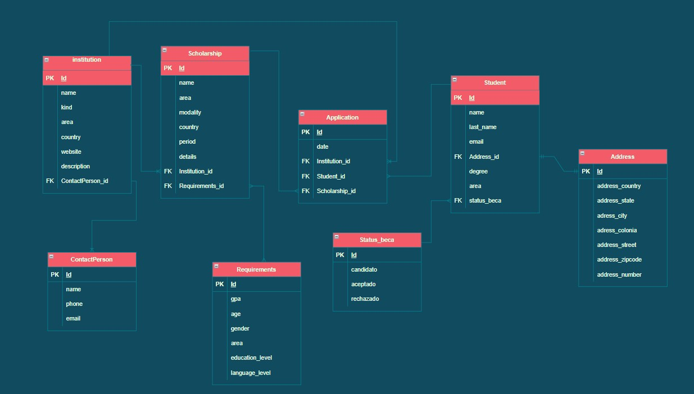

## Equipo 5
### Hackathon: Skills for Women in Tech by Hackademymx and Hackwomen
-------
## Topic
Instituciones y organizaciones internacionales becan a estudiantes para que puedan realizar licenciaturas, maestrías y doctorados en el extranjero pero no se tiene un seguimiento de estos estudiantes.
¿Cómo pudieramos llevar control de las personas becadas, su estatus?
¿Cómo podemos mantener comunicación con ellxs? ¿cómo podemos generar comunidad entre ellxs?

-------
## Tools
   - Python 3.10
   - Django 4.1
   - Django RestFramework 3.13.1

-------
## Deploy: https://becas-equipo5.herokuapp.com/

-------
## Content
[Base de Datos](https://drive.google.com/file/d/1baKjCddjz4BNUK5rYRKrP_5laJpqJOxH/view?usp=sharing)
<picture>
   
</picture>

[Historias de usuario](./img/historias.md)

-------
## Team
   * [Gabriela Hilario](https://github.com/gaby-hack215)
   * [Rocio Xicohténcatl Reza](https://github.com/rocioxire)
   * [Alejandra Benítez](https://github.com/AlexBM45)